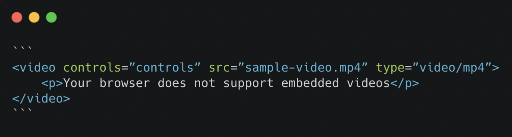

# HTML Management

## HTML5

* API - canvas, audio, and video. HTML has lots of elements that can support video, graphics, and drawings.

* HTML5 good for web applications because my mobile devices with browsers that support HTML5 can process data.

* Web storage APIs can store data in the browser.

* CSS and HTML - more efficent use of images makes web pages load faster.

  

  Image taken from [bitmovin](https://bitmovin.com/html5-video-tag-guide/).
